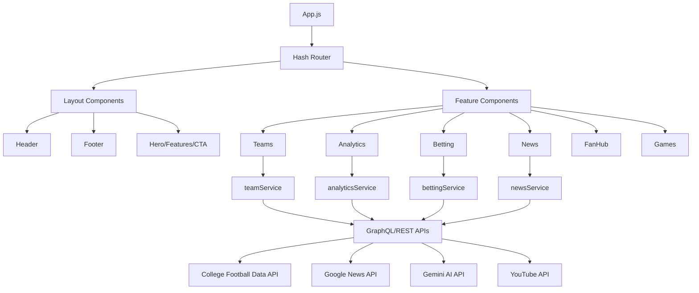
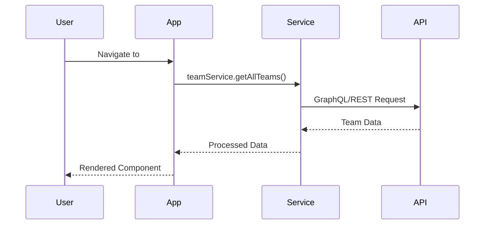
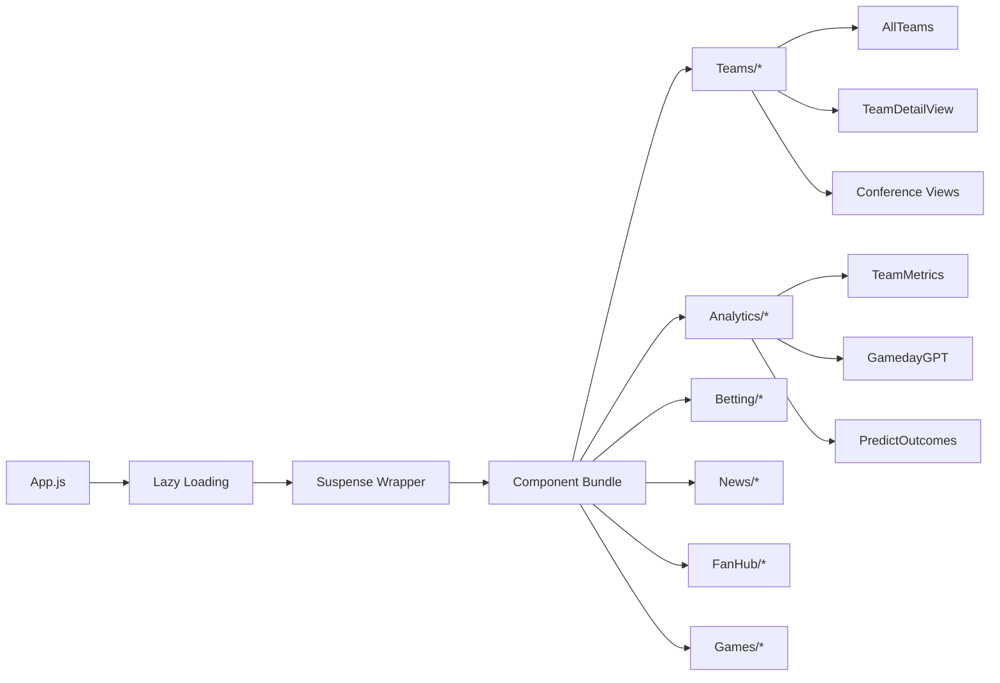

# GAMEDAY+ FanHub - Architecture Overview

## 🏗️ System Architecture

```mermaid
graph TD
    A[App.js] --> B[Hash Router]
    B --> C[Layout Components]
    B --> D[Feature Components]
    
    C --> E[Header]
    C --> F[Footer]
    C --> G[Hero/Features/CTA]
    
    D --> H[Teams]
    D --> I[Analytics]
    D --> J[Betting]
    D --> K[News]
    D --> L[FanHub]
    D --> M[Games]
    
    H --> N[teamService]
    I --> O[analyticsService]
    J --> P[bettingService]
    K --> Q[newsService]
    
    N --> R[GraphQL/REST APIs]
    O --> R
    P --> R
    Q --> R
    
    R --> S[College Football Data API]
    R --> T[Google News API]
    R --> U[Gemini AI API]
    R --> V[YouTube API]
```

## 🔄 Data Flow

```mermaid
sequenceDiagram
    participant User
    participant App
    participant Service
    participant API
    
    User->>App: Navigate to #teams
    App->>Service: teamService.getAllTeams()
    Service->>API: GraphQL/REST Request
    API-->>Service: Team Data
    Service-->>App: Processed Data
    App-->>User: Rendered Component
```

## 📱 Component Architecture

```mermaid
graph LR
    A[App.js] --> B[Lazy Loading]
    B --> C[Suspense Wrapper]
    C --> D[Component Bundle]
    
    D --> E[Teams/*]
    D --> F[Analytics/*]
    D --> G[Betting/*]
    D --> H[News/*]
    D --> I[FanHub/*]
    D --> J[Games/*]
    
    E --> K[AllTeams]
    E --> L[TeamDetailView]
    E --> M[Conference Views]
    
    F --> N[TeamMetrics]
    F --> O[GamedayGPT]
    F --> P[PredictOutcomes]
```
